# Duo apps

Eight iPhone apps for **two people sharing one phone across a table**: a date-night game, a card
battler, a tarot reading table, a magic kit, and tools for interior designers, real estate agents,
speech therapists and trade-show teams. Built for every iPhone and for iPhone Duo, Apple's foldable.

By [Himanshu Singh](https://github.com/HimanshuSingh0495) · Website: https://himanshusingh0495.github.io/

| | App | What it is | Status |
|---|---|---|---|
|  | **DuoNight** | Date-night questions and games for couples: secret answers, "You or Me", guided conversations | In App Review |
| 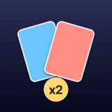 | **SnapTable** | Three-minute two-player card battler on one phone: face-down plays, simultaneous reveal, 100 cards | In App Review |
|  | **Tarot Table: Reader's Kit** | A reading table for professional tarot readers: 78 cards, three spreads, a private reader console | In App Review |
|  | **Duo Mentalism Kit** | Close-up mentalism effects where the phone keeps the performer's secret | In App Review |
|  | **DuoBoard: Mood Boards** | Mood boards and client presentations for interior designers, with private pricing and proposals | In App Review |
|  | **Listing Table** | A listing presentation for real estate agents at the seller's kitchen table | Coming soon |
|  | **DuoSpeak: Speech Practice** | Articulation practice for speech therapy sessions, with scoring kept on the clinician's side | In development |
|  | **BoothLead Duo** | Trade-show lead capture: visitors enter their own details, reps keep private notes | In development |

App Store links appear in the table as each app is approved.

## Screenshots

| DuoNight | SnapTable | Tarot Table | Duo Mentalism Kit |
|---|---|---|---|
| 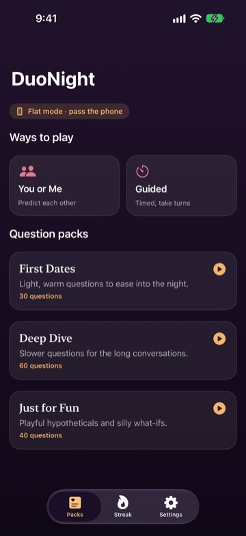 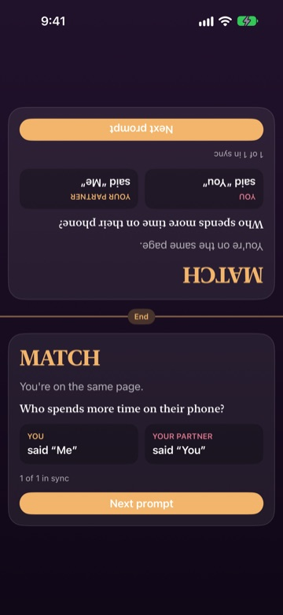 | 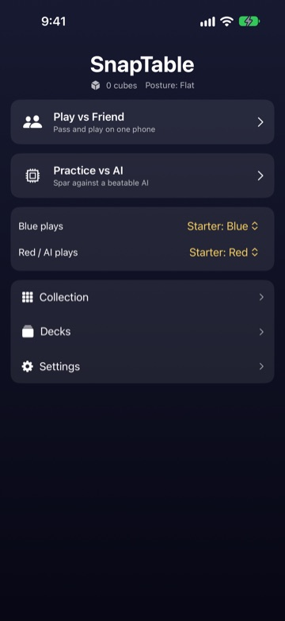 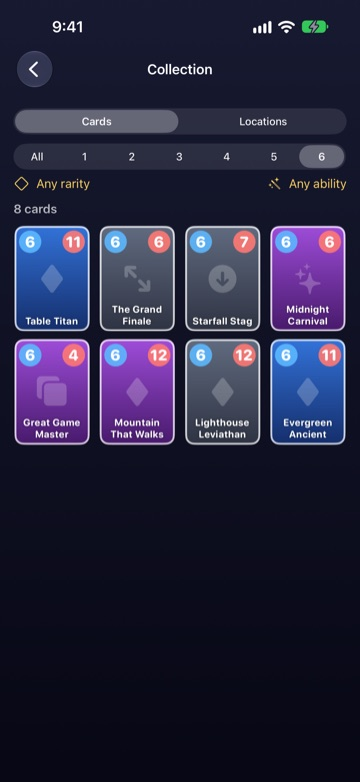 | 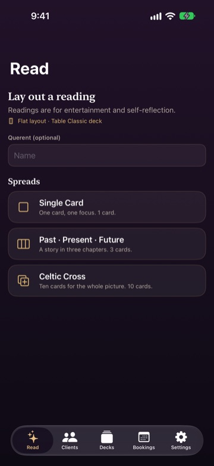 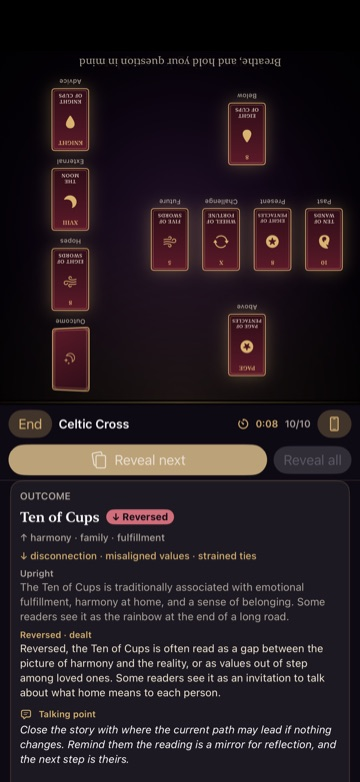 | 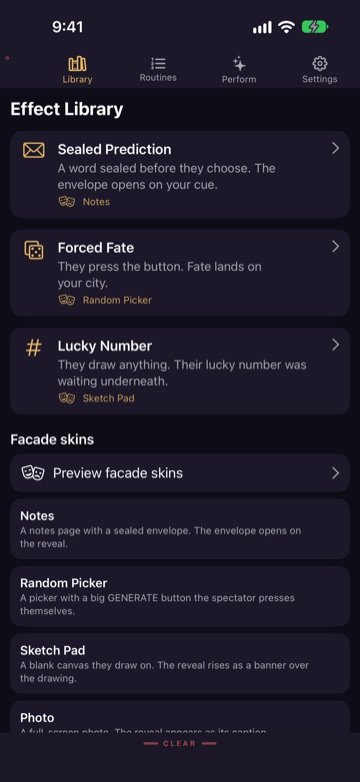 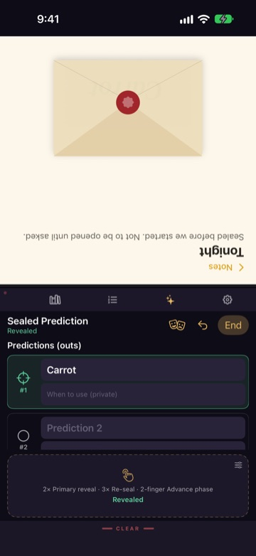 |

| DuoBoard | Listing Table | DuoSpeak | BoothLead Duo |
|---|---|---|---|
| 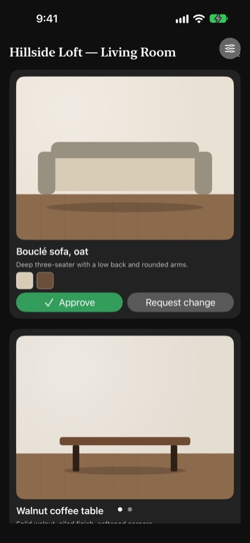 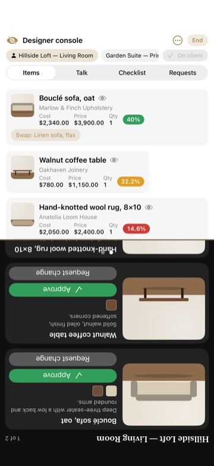 | 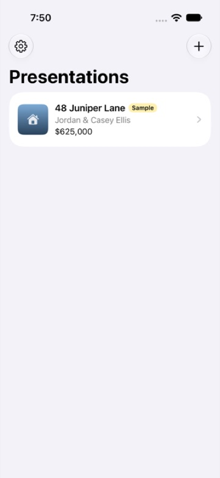 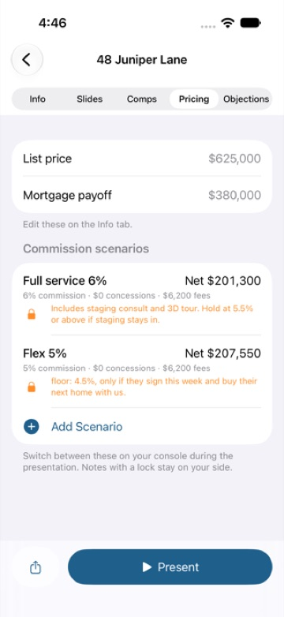 | 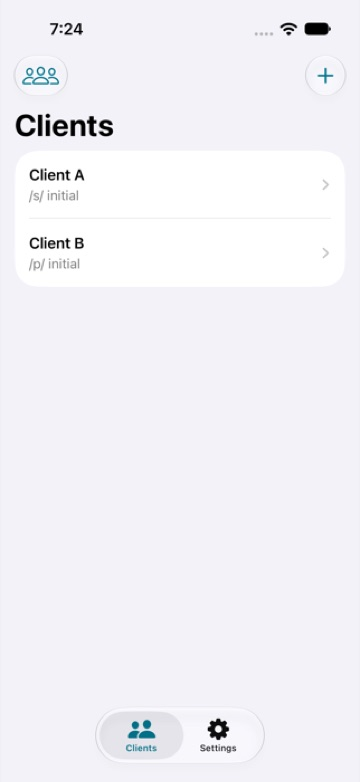 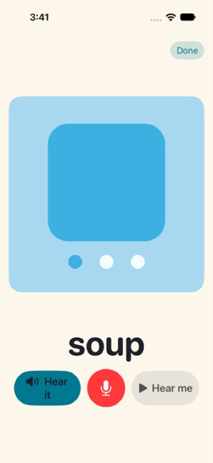 | 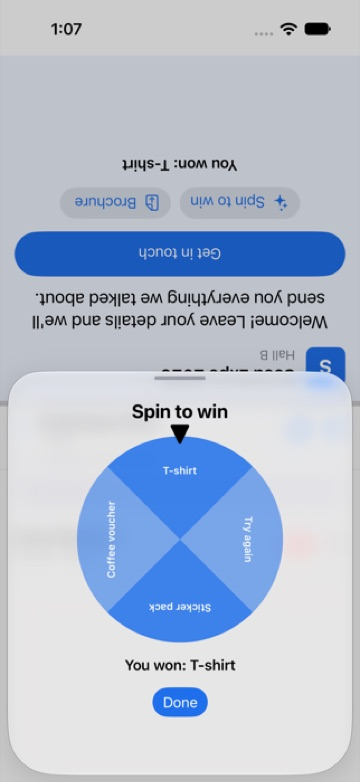 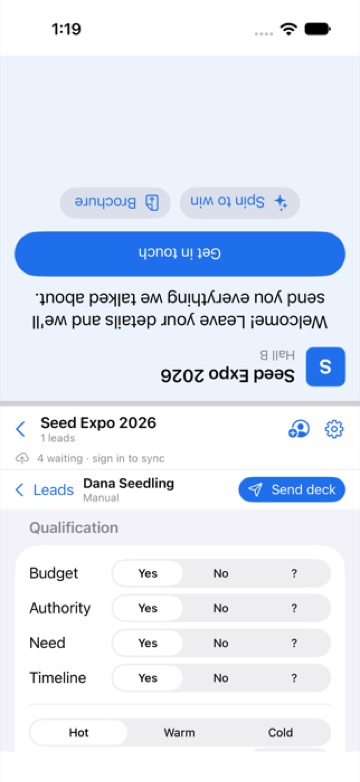 |

## How they're built

- **Swift 6 and SwiftUI**, iOS 26 and later; one codebase per app, no third-party dependencies.
- **SwiftData** for local storage and **CloudKit** for iCloud sync; **StoreKit 2** for future in-app purchases.
- **iPhone Duo support** with the iOS 27.1 hinge and fold APIs: automatic posture from the fold sensor,
  layouts that keep controls out of the fold, and sessions that survive closing the phone mid-use.
- **Tested end to end with XCTest and XCUITest**: 769 automated unit and UI tests across the eight apps,
  including orientation, window-size and fold sweeps.
- **Private by design**: no accounts, no ads, no tracking; App Store privacy label "Data Not Collected"
  for the released apps.
- Built with AI-assisted development (Claude Code) and shipped through the App Store Connect API.

Source code is private. Each app has a privacy policy, terms and support page on the
[website](https://himanshusingh0495.github.io/).
